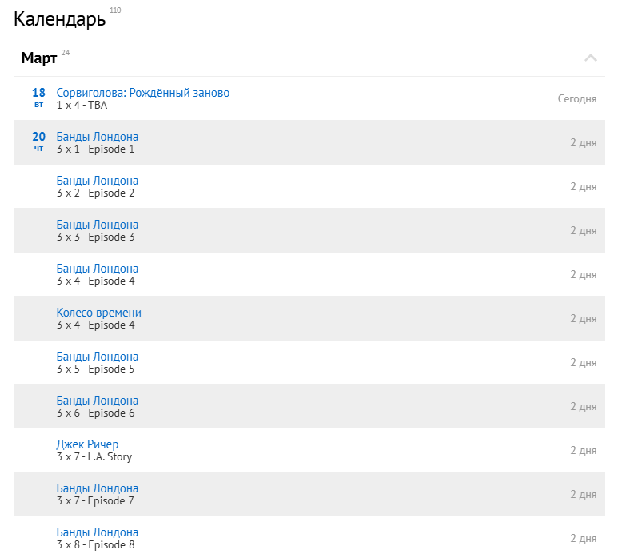
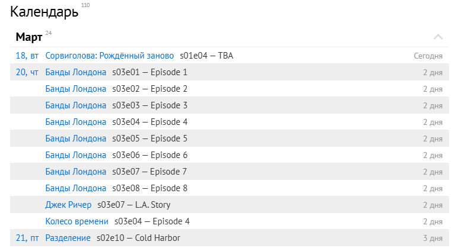

# Исправление интерфейса для сайта myshows.me

## Установка расширения:

1. Установите расширение **[Tampermonkey](https://www.tampermonkey.net/)** (Альтернатива для Safari: **[UserScripts](https://apps.apple.com/app/userscripts/id1463298887)**)
2. **[«Установите Скрипт»](https://raw.githubusercontent.com/viruseg/MyShowsInterfaceFix/master/dist/main.user.js)**

## Список изменений:

- Исправление стилей сайта, делающие его более компактным и удобным.
- Исправление лексической ошибки. "Смотрящие" заменено на "Зрители".
- Кнопка "Свернуть всё" на странице профиля (myshows.me/profile/).
- Отключено автоматическое появление меню при наведении мышки в шапке сайта.
- Автоскрытие раздела "Смотрю" на странице профиля (myshows.me/profile/).
- Клики по строке комментариев и счётчику новых комментариев в меню пользователя ведут в соответствующие разделы. Раньше клик всегда вёл в раздел новых комментариев.

## Скриншоты
До установки стилей и после

Кнопка "Свернуть всё"

Календарь

До изменений:

После изменений:
